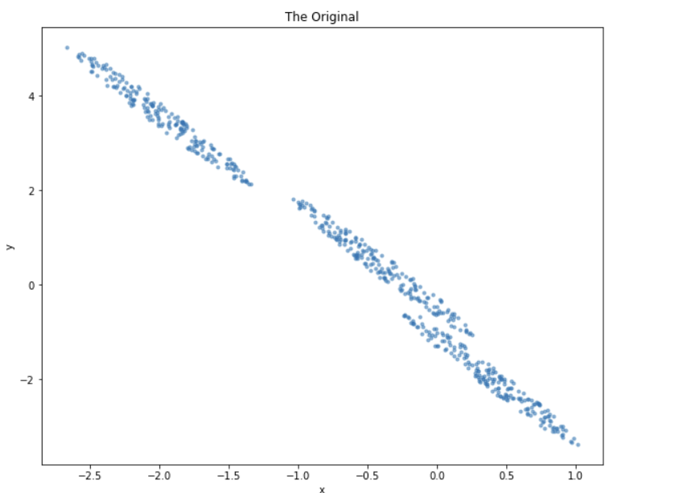
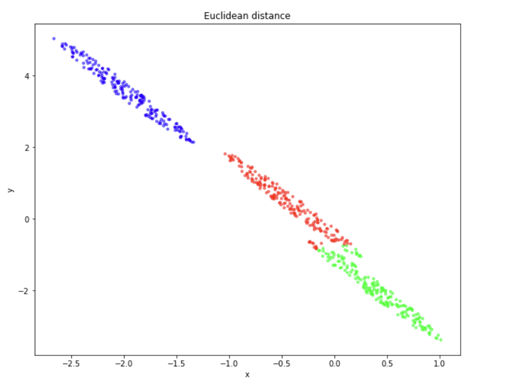
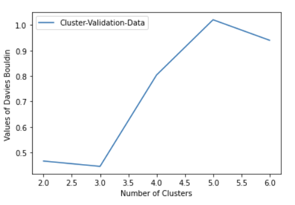

#ML-clustering k-means

## implement the k-means algorithm using the Mahalanobis distance
Implement the k-means algorithm using the Mahalanobis distance instead of the standard Euclidean distance. Then, create a toy dataset with 2 or 3 dimensions (so it is possible to easily visualize the data) with roughly 500 data points. Such a dataset should be designed so that it allows you to show how and when k-means operating with the Mahalanobis distance works better than k-means equipped with the Euclidean distance and a centroid-based cluster representative.

#### Results:
#### Figure1:The Original

#### Figure2:Euclidean distance

#### Figure3:Mahalanobis distance

#### Implementaion of Vavies0Bouldin index for cluster validation
Implement the Davies-Bouldin index for cluster validation (intrinsic cluster validation). Then, perform model selection for finding the best partition order k of k-means. For this part of the project, use the standard k-means implementation operating with the Euclidean distance and centroids as cluster representatives. Perform simulations and comments on the results obtained on the dataset named "cluster_validation_data.txt" that has been provided with this notebook.

#### Results:

